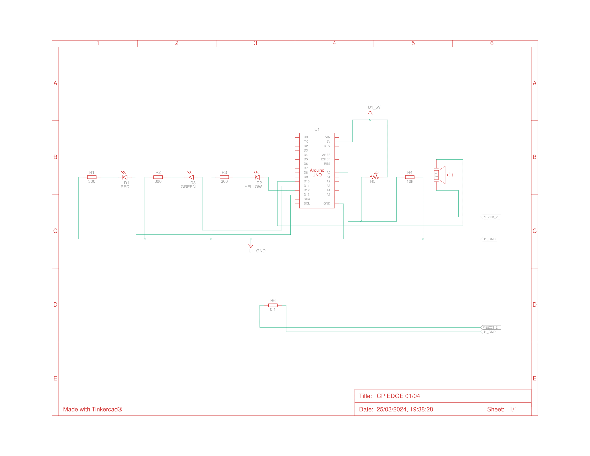

# Checkpoint 1 - Edge Computing

## Descrição do Projeto:
O projeto apresentado visa fiscalizar o armazenamento de grandes quantidades de vinho, pelo parâmetro de luminosidade. Nesse modelo, para realizar a ação em questão, o circuito conta com recursos tanto visuais como sonoros para fornecer maior controle sobre o ambiente.

## Componentes Utilizados:
- Arduino Uno R3
- Placa de Ensaio
- 3 Leds (Vermelho, Amarelo e Verde)
- 3 Resistores 300 Ω
- 1 Resistor 0.1 Ω
- 1 Resistor 10 kΩ
- 1 LDR
- 1 Buzzer

~~~
// Nessa versão as luzes acedem em  ordem crescente
// Definindo os pinos onde estão conectados os componentes
const int ldr  =A0;   // Pino analógico para o LDR
const int ledVerde = 11;  // Pino para o LED verde
const int ledAmarelo = 12; // Pino para o LED amarelo
const int ledVermelho = 13; // Pino para o LED vermelho
const int buzzer = 10; // Pino para o buzzer

const int alertaMin = 54;
const int alertaMax = 860;

int luminosidade = 0;

void setup() {
  pinMode(ldr, INPUT);
  pinMode(ledVerde, OUTPUT);
  pinMode(ledAmarelo, OUTPUT);
  pinMode(ledVermelho, OUTPUT);
  pinMode(buzzer, OUTPUT);

  Serial.begin(9600); // Inicia a comunicação serial para depuração
}

void loop() {
  luminosidade = analogRead(ldr);
  Serial.println("Luminosidade: " + String(luminosidade));//Imprime o valor de luminosidade no monitor serial

  if (luminosidade >= alertaMin && luminosidade <= alertaMax) { //Piscar led verde valor de luminosidade OK
    digitalWrite(ledVerde, HIGH);
    digitalWrite(ledAmarelo, LOW);
    digitalWrite(ledVermelho, LOW);
  
    Serial.println("OK");
  } else if (luminosidade > alertaMax && luminosidade <= 950) { //Piscar led amarelo, valor de luminosidade em alerta
    digitalWrite(ledVerde, LOW);
    digitalWrite(ledAmarelo, HIGH);
    digitalWrite(ledVermelho, LOW);
    tone(buzzer, 3000, 150);
    
    
    Serial.println("Alerta");
   
  } else {
    digitalWrite(ledVerde, LOW); //Piscar led vermelho, valor de luminosidade problematico
    digitalWrite(ledAmarelo, LOW);
    digitalWrite(ledVermelho, HIGH);
    
    Serial.println("Problema");
  }
  
  delay(1000);
}
~~~
